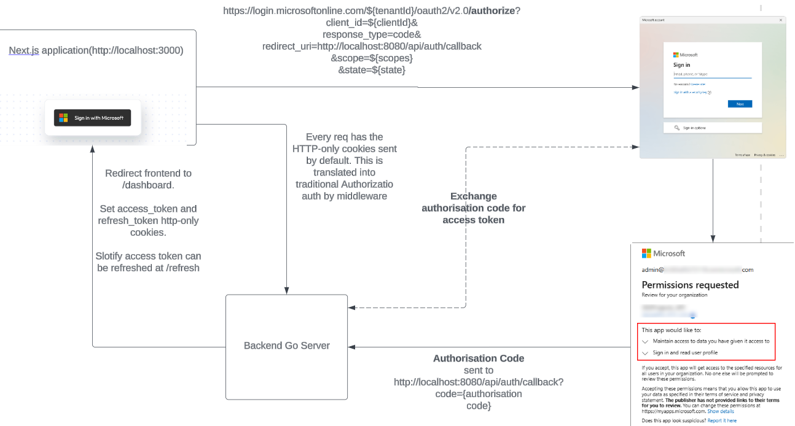

# slotify-backend

## Set up

1. Clone repo, there is a submodule so you must use:

```bash
git clone --recurse-submodules
```

2. Install `make`

3. Install `pre-commit`:

```bash
    pip install pre-commit
    pre-commit install --hook-type pre-push
```

4. Install the other hooks:

```bash
    pre-commit install
```

This will make sure that golang ci lint is ran before you commit so we don't need to
fix errors after pushing.

5. Install Golang (Go is still needed for go generate ./..., if this is a problem we can dockerise)
6. Run the app through:

```bash
    make generate # locally runs go and generates files needed, must be run
    make run # runs docker compose up, starts up golang server and db in containers
    make stop # docker compose down, stops the above containers

```

(See other options in the Makefile)

## Project Structure

```
.
├── api # API code
├── api_docs # API Docs that were automatically generated (see below)
├── cmd # Entry point to our API
├── database # Database utilities
├── generate # Defines go files for oapi-codegen generation (see below)
├── go.mod
├── go.sum
├── integration # Integration tests
├── Makefile # Defines commands to use for this app (eg. make run)
├── oapi_codegen_cfg_schema.json # schema for oapi-codegen options (see below)
├── README.md
├── shared # shared repo submodule (containing docker containers and db schema)
├── testutil # test utilities
└── tools # Folder is needed for oapi-codegen dependencies, so it doesn't clutter our main go.mod
```

## OpenAPI

Our OpenAPI spec can be found at openapi.yaml

[oapi-codegen Go lib](https://github.com/oapi-codegen/oapi-codegen) is used to generate server code
based on `shared/openapi/openapi.yaml`, so things like input validation,
registering handlers among other things are automated.

`/generate/oapi_codegen_cfg.yaml` defines our oapi-codegen config (eg. what Go server to use), to see everything that can be stated in this file see the oapi_codegen_cfg_schema.json

Using OpenAPI means API documentation (routes, parameters, etc.) is generated for us, which can be done by doing:

```bash
make generate_api_docs
```

This will regenerate the API docs which can be found under api_docs/

```bash
make generate
```

This will generate API code based on our spec into a file named `api/server.gen.go`

## OpenID Microsoft Flow and Slotify API protection



In order to authenticate a user, the [OpenID Connect flow](https://openid.net/developers/how-connect-works/) is used, this
is done through a [authorisation code flow](https://auth0.com/docs/get-started/authentication-and-authorization-flow/authorization-code-flow).

Slotify's API has its own protection in the form of a JWT access and refresh token. This is stored in the frontend
as http-only cookies which are sent with every fetch request.

## Notifications

We have real-time notifications set up.

### Usage:

```go
    // This is it
    // s is the Server type
    s.NotificationService.SendNotification(...)
```

### How do they work?

Our notification system uses [server-side events](https://developer.mozilla.org/en-US/docs/Web/API/Server-sent_events/Using_server-sent_events).

A map of clients is mapped to each user, a client is registered when a client uses the website and makes a call to the
`/api/events` eventstream route. From there, notifications can be sent from server to client in real time.

If a notification is meant for a user who doesn't have a client (ie. not currently using the website, imagine an offline user
was added to a team), then on the next login these notifications are fetched from the database and displayed.
